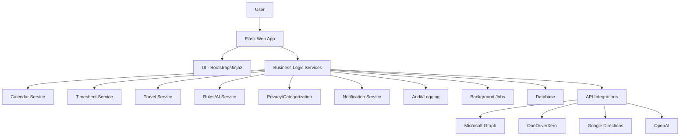

# System Architecture

- **Owner**: Auriora Team
- **Status**: Accepted
- **Created Date**: DD-MM-YYYY
- **Last Updated**: 2024-12-19
- **Audience**: [Developers, Architects]

## 1. Purpose

This document describes the high-level system architecture for the Admin Assistant application. It outlines the major components, their interactions, the core design patterns, and the architectural principles that guide development.

## 2. Context

Admin Assistant is a modular, service-oriented web application designed to automate calendar management and related administrative tasks. The architecture must support extensibility for future features (like multi-user support), ensure a clear separation of concerns, and provide a secure, resilient, and auditable system.

### Architectural Principles
- **Separation of Concerns:** Clear separation between UI, business logic, data access, and integrations.
- **Extensibility:** Modular design for future features and integrations.
- **Security:** Secure authentication, encrypted data, and safe API handling.
- **Resilience:** Graceful error handling and retries for all external integrations.
- **Auditability:** Centralized, secure logging of all critical actions.

## 3. Details

### 3.1. System Architecture Diagrams

### 3.2. Component Breakdown

- **Presentation Layer (UI)**: A Flask web application serving Jinja2 templates with Bootstrap for a responsive UI. Handles user authentication via Microsoft OAuth2.
- **Business Logic Layer**: A set of service modules handling specific domains like Calendar, Timesheets, Travel, and AI-driven Rules.
- **Data Layer**: A relational database (PostgreSQL/SQLite) managed via SQLAlchemy ORM.
- **Integration Layer**: Encapsulated clients for all external APIs (Microsoft Graph, OneDrive, Xero, Google Directions, OpenAI).
- **Audit & Logging**: A centralized service for logging all critical actions, errors, and API calls to a database audit table.
- **Background Processing**: A task queue (e.g., Celery, RQ) for long-running or scheduled jobs like daily archiving.
- **Command-Line Interface (CLI)**: A `Typer`-based CLI for administrative and automation tasks, interacting directly with the core business logic.

### 3.3. Core Layer and Data Access Patterns

The `core/` directory encapsulates all business logic and data access abstractions, ensuring a clean separation of concerns.

- **Repository Pattern**: Each domain entity has a repository interface with concrete implementations for each backend (e.g., `SQLAlchemyAppointmentRepository`, `MSGraphAppointmentRepository`). This allows business logic to be data-source agnostic.
- **Store Pattern**: Provides generic CRUD operations, further abstracting data access.
- **Factory Pattern**: Instantiates the correct repository or store implementation based on configuration.

### 3.4. Orchestrator Pattern

A key pattern in this architecture is the **Orchestrator**, which is the single entry point for complex operations that span multiple services or data backends.

- **Example**: The `CalendarArchiveOrchestrator` coordinates fetching appointments from MS Graph, expanding recurrences, detecting overlaps (using pure logic from a service), archiving valid appointments back to MS Graph, and logging conflicts to the local database.
- **Benefits**: This centralizes side effects (DB writes, API calls), keeps the service layer for pure logic, and improves testability and maintainability.

### 3.5. Technology Choices

| Layer | Technology/Tooling |
|---|---|
| Web Framework | Flask (Python) |
| UI | Bootstrap, Jinja2 |
| CLI | Typer, Click, or argparse |
| Auth | Flask-OAuthlib, MSAL, Flask-Login |
| DB | PostgreSQL/SQLite + SQLAlchemy |
| Background Jobs | Celery, RQ, or Flask-APScheduler |
| Logging/Audit | Python logging, DB audit table |
| API Integrations | Requests, msal, custom clients |
| Testing | Pytest, coverage |
| Containerization | Docker, docker-compose |

## 4. Security & Compliance

- **Authentication**: All access is secured via Microsoft OAuth2/OpenID Connect.
- **Data Encryption**: Sensitive data is encrypted at rest and all traffic uses HTTPS.
- **Secrets Management**: API keys and other secrets are managed via environment variables or a secure vault.
- **Input Sanitization**: All inputs, especially those for AI and external APIs, are sanitized.

# References

- [CLI Design Document](./HLD-CLI-001-Command-Structure.md)
- [Application Data Model](./DATA-001-Application-Data-Model.md)