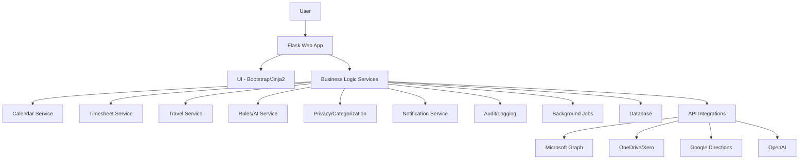
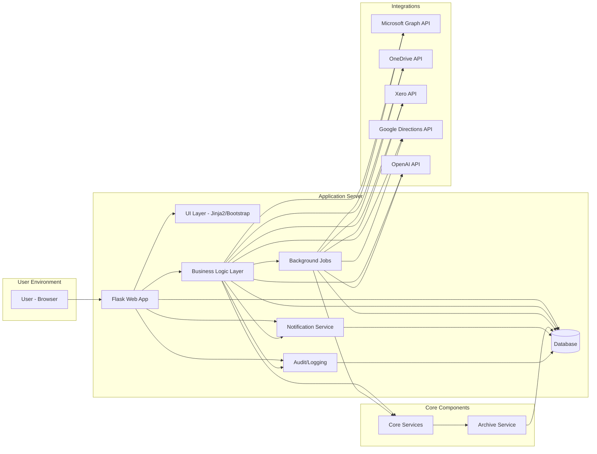

# Admin Assistant System Architecture

## 1. High-Level Overview

Admin Assistant is a modular, service-oriented web application designed to automate and streamline calendar management, timesheet extraction, billing, and travel calculation for professionals using Microsoft 365 Calendar. The system is built for single-user operation initially, with provisions for future multi-user and role-based support. It integrates with Microsoft 365 Calendar, OneDrive, Xero, Google Directions API, and OpenAI.

In addition to the web UI, the system provides a command-line interface (CLI) in the `cli/` directory for administrative, automation, and scripting tasks.

---

## 2. Architectural Principles
- **Separation of Concerns:** Clear separation between UI, business logic, data access, and integrations.
- **Extensibility:** Modular design for future features (multi-user, roles, new integrations).
- **Security:** OAuth2/OpenID Connect, encrypted data, secure API handling.
- **Resilience:** Graceful error handling, retries, and user notifications for all external integrations.
- **Auditability:** Centralized, secure logging of all critical actions and changes.

---

## 3. Component Diagram



---

## 3.1 System Architecture Diagram



---

## 4. Component Breakdown

### A. Presentation Layer (UI)
- **Flask + Jinja2 Templates:** Responsive web UI using Bootstrap.
- **Views/Controllers:** For calendar, timesheet, travel, rules, and admin.
- **Authentication:** Microsoft OAuth2/OpenID Connect (Flask extension).

### B. Business Logic Layer
- **Service Modules:**
  - **Calendar Service:** Archiving, overlap resolution, time zone logic.
  - **Timesheet Service:** Extraction, categorization (AI-assisted), PDF/CSV/Excel export.
  - **Travel Service:** Location recommendation, travel time calculation, Google Directions API integration.
  - **Rules Engine:** User-editable rules, OpenAI integration for recommendations.
  - **Privacy & Categorization Service:** Privacy marking, category assignment, user overrides.
  - **Notification Service:** Email and in-app notifications.

### C. Data Layer
- **Database:** Relational (PostgreSQL or SQLite for MVP), storing user profiles, archived appointments, rules, audit logs, configuration, etc.
- **ORM:** SQLAlchemy or Flask-SQLAlchemy for data access.

### D. Integration Layer
- **Microsoft Graph API:** Calendar access, authentication.
- **OneDrive/Xero APIs:** File upload, billing integration.
- **Google Directions API:** Travel time estimation.
- **OpenAI API:** Recommendations, categorization.
- **API Client Modules:** Each integration encapsulated in its own module/service.

### E. Audit & Logging
- **Centralized Logging:** All critical actions, errors, and API calls.
- **Audit Trail:** For automated changes, privacy actions, and user overrides.
- **Log Management:** Pruning/archiving old logs.

### F. Background Processing
- **Task Queue:** For long-running or scheduled jobs (e.g., Celery with Redis/RQ, or Flask background jobs).
- **Examples:** Daily archiving, retrying failed API calls, backup jobs.

### G. Command-Line Interface (CLI)
- **CLI (`cli/` directory):** Provides a command-line interface for administrative, maintenance, and automation tasks (e.g., archiving, export, user management, diagnostics).
- **Interaction:** The CLI interacts directly with the core layer, invoking the same business logic and services as the web UI, ensuring feature parity and consistent behavior.
- **Use Cases:** Supports automation, scripting, headless operation, and advanced user workflows. All major features available in the web UI should be accessible via the CLI.
- **Security:** CLI commands requiring sensitive operations must enforce authentication and log all actions for auditability.
- **See also:** [CLI Design Document](UXF-CLI-001-Command-Line-Interface.md)

### H. Overlap Resolution, Virtual Calendar, and AI Chat Service

- **Overlap Resolution Service:** Handles user-driven resolution of overlapping appointments, presenting options to keep, edit, merge, or create new appointments. Integrates with the ActionLog and virtual calendar for grouping and context.
- **Virtual Calendar:** A special data structure (backed by the database) that groups overlapping appointments for each resolution action, ensuring all details are available during the process. Referenced by ActionLog entries.
- **Persistent Chat/AI Integration:** Provides a chat interface for user interaction during overlap resolution (and other features in future). Stores chat history for asynchronous and collaborative workflows. Integrates with OpenAI to suggest resolutions, merged subject lines, and descriptions.
- **Interaction:** The Overlap Resolution Service retrieves unresolved overlaps from the ActionLog/virtual calendar, presents them to the user (with AI suggestions), and applies user-driven resolutions, updating the relevant repositories and logs.

### I. Generic Entity Association, Prompt Management, and Extensible AI Integration

- **Generic Entity Association:** All cross-entity relationships (e.g., linking ActionLog to calendars, appointments, chat sessions, etc.) are managed via a single, generic `entity_association` table. This reduces schema complexity and supports future extensibility.
- **Prompt Table:** The `Prompt` table stores system, user, and action-specific prompts for AIService, enabling advanced, context-aware, and personalized AI interactions.
- **ActionLog:** Serves as the central, extensible task/action list for user attention and audit. It includes a `recommendations` field for serialized AI suggestions and is linked to other entities via `entity_association`. The `state` field tracks open/resolved/archived status.
- **ChatSession:** A generic, persistent chat entity, mapped to actions/tasks or other entities via `entity_association`. Supports both synchronous and asynchronous workflows, and is extensible for future features.
- **Extensibility & Auditability:** This design allows any feature to create ActionLog entries, link to any entity, and leverage AIService for recommendations and chat. All actions and AI suggestions are logged, providing a full audit trail and supporting compliance, analytics, and future feature growth.

---

## 4.1 Core Layer and Data Access Patterns

The `core/` directory encapsulates all business logic, domain models, and data access abstractions. This layer is designed to ensure a clean separation between the web interface, business rules, and data storage or external APIs.

### Structure of `core/`
- `core/models/`: SQLAlchemy models for all domain entities (User, Appointment, Category, etc.).
- `core/repositories/`: Repository interfaces and implementations for each entity, supporting multiple backends (e.g., SQLAlchemy, Microsoft Graph API).
- `core/stores/`: Store abstractions for generic CRUD operations, supporting both SQLAlchemy and MS Graph.
- `core/services/`: Business logic and domain services (e.g., calendar archiving, recurrence expansion, overlap detection).

### Design Patterns
- **Repository Pattern:**
  - Each domain entity (e.g., Appointment) has a base repository interface (abstract class) and concrete implementations for each backend. This allows business logic to remain agnostic of the underlying data source.
- **Store Pattern:**
  - Stores provide generic CRUD operations for entities, further abstracting the data access layer and enabling code reuse.
- **Factory Pattern:**
  - Factories are used to instantiate the appropriate repository or store implementation based on configuration or runtime context.

### Extensibility and Maintainability
- New data backends (e.g., REST APIs, other databases) can be added by implementing the repository and/or store interfaces.
- Business logic in `core/services/` can operate on any repository/store implementation, supporting future requirements and integrations.
- All business logic, validation, and data transformation are handled in the `core/` layer, keeping the web and presentation layers decoupled from data access details.

### Example Class Diagram

```mermaid
graph TD
    AppointmentModel[Appointment (SQLAlchemy Model)]
    BaseRepo[BaseAppointmentRepository (Abstract)]
    SQLARepo[SQLAlchemyAppointmentRepository]
    MSGraphRepo[MSGraphAppointmentRepository]
    StoreBase[BaseStore (Abstract)]
    SQLAStore[SQLAlchemyStore]
    MSGraphStore[MSGraphStore]
    Factory[AppointmentRepositoryFactory]

    AppointmentModel --> SQLARepo
    BaseRepo <|-- SQLARepo
    BaseRepo <|-- MSGraphRepo
    SQLARepo --> SQLAStore
    MSGraphRepo --> MSGraphStore
    Factory --> SQLARepo
    Factory --> MSGraphRepo
```

### Usage in Application
- The web layer (Flask) interacts only with the core services and repositories, never directly with the database or external APIs.
- All business logic, validation, and data transformation are handled in the `core/` layer, ensuring testability and extensibility.

---

## 5. Technology Choices

| Layer                | Technology/Tooling                |
|----------------------|-----------------------------------|
| Web Framework        | Flask (Python)                    |
| UI                   | Bootstrap, Jinja2                 |
| CLI                  | Typer, Click, or argparse (Python) |
| Auth                 | Flask-OAuthlib, MSAL, Flask-Login |
| DB                   | PostgreSQL/SQLite + SQLAlchemy    |
| Background Jobs      | Celery, RQ, or Flask-APScheduler  |
| Logging/Audit        | Python logging, DB audit table    |
| API Integrations     | Requests, msal, custom clients    |
| Testing              | Pytest, coverage                  |
| Containerization     | Docker, docker-compose            |

---

## 6. Security & Compliance
- **OAuth2/OpenID Connect:** Microsoft authentication for all users.
- **Role/Permission System:** Designed for future multi-user/role support.
- **Data Encryption:** At rest and in transit (HTTPS).
- **Secrets Management:** Environment variables or secure vault for API keys.
- **Input Sanitization:** Especially for AI and external API calls.
- **Compliance:** GDPR, API ToS, auditability, and user consent.

---

## 7. Extensibility & Maintainability
- **Modular Codebase:** Each service/integration is a separate module.
- **Configurable Settings:** All environment-specific settings externalized.
- **API-First:** Consider exposing core features via REST API for future mobile or third-party integrations.
- **Testing:** Unit and integration tests for all modules, especially for business logic and integrations.

---

## 8. Deployment
- **Containerization:** Docker for consistent deployment.
- **Cloud/On-Premise Ready:** Can be deployed on any standard infrastructure.
- **CI/CD Pipeline:** Automated testing, linting, and deployment.

---

## 9. Future-Proofing
- **Multi-user/Role Support:** Design DB and services with user/role fields, even if only one user for MVP.
- **Plug-in Integrations:** Abstract integration logic for easy addition of new APIs/services.
- **Scalability:** Stateless app servers, scalable DB, and background workers.

---

## 10. Summary

This architecture meets all functional and non-functional requirements, is modular, secure, and extensible for future needs, and supports robust error handling, auditability, and compliance. It is well-suited for a Python/Flask-based web application with multiple third-party integrations. 